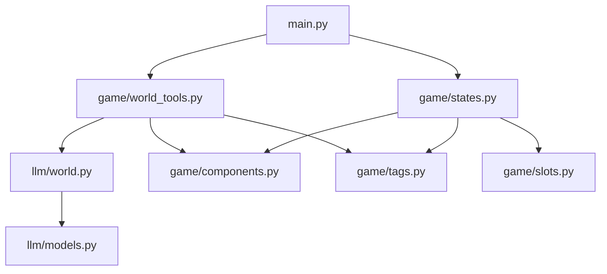
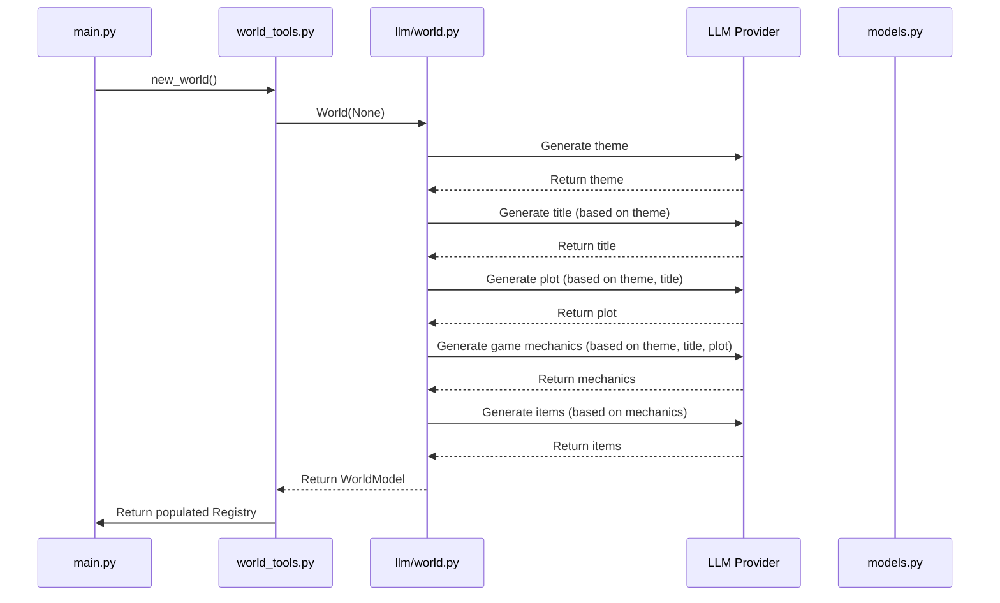

# AiRogue Project Analysis

## Overall Architecture

AiRogue is a roguelike game that leverages LLMs (Large Language Models) to dynamically generate game content, including themes, plots, game mechanics, and items. The project follows a component-based architecture using TCOD (libtcod) for rendering and event handling.

### Key Components:

1. **Main Module (`main.py`)**: 
   - Entry point for the application
   - Initializes the TCOD context, console, and game state
   - Sets up the main game loop for rendering and event handling

2. **Game Module (`game/`)**: 
   - `states.py`: Manages game states and event handling
   - `components.py`: Defines entity components (Position, Graphic, etc.)
   - `tags.py`: Contains tags for entity categorization (IsPlayer, IsItem, etc.)
   - `slots.py`: Implements actions that can be triggered by game events
   - `world_tools.py`: Handles world generation and entity creation

3. **LLM Module (`llm/`)**: 
   - `world.py`: Core class for LLM-based world generation
   - `models.py`: Contains Pydantic models for structured data exchange with LLMs
   - `providers/`: Contains LLM provider implementations

4. **Global State (`g.py`)**:
   - Maintains global variables like the current world and context

## LLM Flow and World Building

The world building process follows these steps:

1. **Theme Generation**: The LLM generates multiple themes and selects one randomly.
2. **Title Generation**: Based on the selected theme, a title is generated.
3. **Plot Generation**: Using the theme and title, a plot is created.
4. **Game Mechanics Generation**: Game mechanics are generated considering the theme, title, and plot.
5. **Item Generation**: Items are generated for each game mechanic.
6. **World Model Creation**: All generated content is assembled into a `WorldModel`.
7. **Entity Creation**: Game entities are created from the `WorldModel` and added to the game world.

The LLM chain uses LangChain to compose the generation pipeline, with each step building on the outputs of previous steps. The project currently uses OpenAI's GPT-3.5-Turbo model with specific prompts designed for game content generation.

## Supported Mechanics for World Building

The system is designed to support the following mechanics during world building:

1. **Component-Based Entities**: 
   - Entities can have various components (Position, Graphic, etc.)
   - Components define behavior and properties
   - Dynamic component addition/removal

2. **Signal/Slot System**:
   - Entities can emit signals in response to events
   - Slots are functions that respond to signals
   - Allows for event-driven gameplay mechanics

3. **Tag System**:
   - Tags categorize entities (IsPlayer, IsItem, etc.)
   - Tags can be used for entity queries and filtering
   - Position is mirrored as a tag for spatial queries

4. **Attribute System**:
   - Entities can have attributes with dynamic values
   - Attributes can be changed via slots

5. **Procedural Content Generation**:
   - LLM-generated themes, plots, mechanics, and items
   - Structured output parsing with Pydantic models
   - Multi-stage generation with context inheritance

6. **Game Mechanics Definition**:
   - LLM defines game mechanics as name/description pairs
   - Mechanics guide item generation
   - Mechanics can implement various gameplay systems

## Structure Improvement Suggestions

To make the project more readable and maintainable, consider the following improvements:

1. **Documentation**:
   - Add docstrings to all classes and functions
   - Create a high-level architecture document
   - Document the LLM prompts and their expected outputs

2. **Code Organization**:
   - Split `world.py` into smaller, focused modules
   - Move LLM provider specifics to `providers/` directory
   - Create a dedicated directory for content generation

3. **Abstract Interfaces**:
   - Define clear interfaces for components and systems
   - Create an abstraction layer for LLM interactions
   - Implement a proper ECS (Entity Component System) architecture

4. **Error Handling**:
   - Add robust error handling for LLM calls
   - Implement fallbacks for LLM failures
   - Add validation for LLM-generated content

5. **Configuration Management**:
   - Move hardcoded values to configuration files
   - Create environment-specific configuration profiles
   - Implement a configuration validation system

6. **Testing**:
   - Add unit tests for component logic
   - Create integration tests for LLM chains
   - Implement mock LLMs for testing

7. **Refactoring**:
   - Remove commented-out code
   - Fix TODOs in the codebase
   - Standardize naming conventions

## Roadmap Based on TODOs and Analysis

### Short-term Tasks:

1. **Fix Immediate Issues**:
   - Fix the component query in `states.py` (line 47: `(game_component,) = g.world.Q.all_of(components=[])  # TODO fix`)
   - Implement the `remove_from_map` function in `slots.py`
   - Clean up commented code in `world_tools.py` and `world.py`

2. **Core Engine Improvements**:
   - Complete the signal/slot system implementation
   - Enhance the component system to support more complex behaviors
   - Improve entity querying with better filtering

3. **LLM Integration**:
   - Refine prompts for more consistent output
   - Add caching for LLM-generated content
   - Implement retries for failed LLM calls

### Medium-term Tasks:

1. **Content Generation**:
   - Add support for generating maps and levels
   - Implement more complex item relationships
   - Create NPC generation and behavior systems

2. **Game Systems**:
   - Develop combat mechanics
   - Implement inventory management
   - Add progression systems

3. **User Experience**:
   - Improve the UI with menus and status displays
   - Add help and tutorial systems
   - Implement save/load functionality

### Long-term Goals:

1. **Advanced Features**:
   - Implement dynamic storyline generation
   - Create adaptive difficulty systems
   - Develop meta-progression between playthroughs

2. **Performance Optimization**:
   - Optimize entity component system
   - Implement efficient spatial partitioning
   - Reduce memory usage

3. **Extensibility**:
   - Create a plugin system for custom mechanics
   - Develop tools for content creators
   - Support modding capabilities

## Conclusion

AiRogue is an innovative project combining traditional roguelike gameplay with modern LLM-based content generation. The architecture has a solid foundation, but needs cleaner organization and more robust implementation of key systems. By following the suggested improvements and roadmap, you can transform it into a maintainable and expandable platform for creating unique procedurally generated games.
